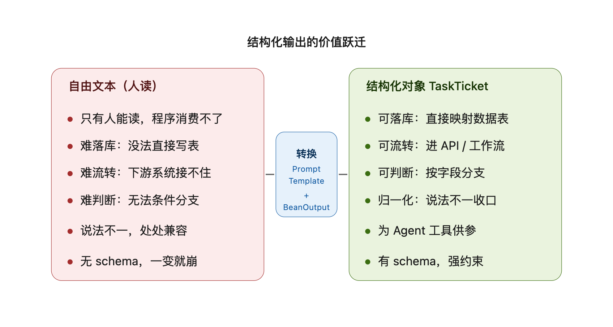

# 阶段 2 知识点总结 —— 结构化输出（PromptTemplate + BeanOutputConverter）

> 阶段 2 目标：让 LLM 从"能说"变成"能干活"——把模型的自由文本收敛成规整的 Java 对象。
> 主线只有两块原语，但**为什么这么做**（产品价值 / 工程取舍 / 前瞻铺垫）比 API 本身更值得记。
> 你已本地调试 + 验证全部通过 ✅，本篇把知识点、踩的 API 坑、以及"这样做的好处"一并固化。

---

## 0. 一句话心智模型

> **PromptTemplate 负责"把提示词写成可复用的模板"，BeanOutputConverter 负责"把模型输出解析成对象"。两者合起来，等于给 LLM 加了一个强类型的 JSON 出口。**

再补一句定位：

> 阶段 0/1 的产出是"聊天"（自由文本，只有人能读）；阶段 2 的产出是"接口"（结构化对象，程序能消费）。这一步，是 Agent 工作台从"会话"走向"系统"的拐点。

---

## 1. 主线（计划内）：结构化输出的两块原语

### 1.1 BeanOutputConverter<T> —— 文本 → Java 对象

Spring AI 提供的转换器，底层基于 Jackson + JSON Schema。标准三步：

```java
// a. 构造时传入目标类型（做成单例复用，见 3.2）
BeanOutputConverter<TaskTicket> converter = new BeanOutputConverter<>(TaskTicket.class);

// b. 拿到 JSON Schema 格式说明，塞进 prompt，逼模型按结构输出
String format = converter.getFormat();

// c. 模型返回文本后，convert 直接得到对象
TaskTicket ticket = converter.convert(responseText);
```

⚠️ `convert` 期望的是**纯 JSON 文本**。所以 prompt 里要明确要求模型"只输出 JSON，不要 ```json``` 标记、不要解释文字"——否则 `convert` 解析会失败。

### 1.2 PromptTemplate —— 提示词模板化

`{占位符}` 占位 + `.variables(Map)` 渲染，提示词可复用、可参数化：

```java
Prompt prompt = PromptTemplate.builder()
        .template("请把需求解析为工单：\n{text}\n格式：\n{format}")
        .variables(Map.<String, Object>of("text", text, "format", format))
        .build()
        .create();
```

### 1.3 高层封装：ChatClient.entity() vs 显式转换

`ChatClient` 其实也有 `.entity(TaskTicket.class)` 隐式帮你转换。但阶段 2 我们**显式**用 `BeanOutputConverter` + `PromptTemplate`，目的是把原理讲透、代码更好复用、格式说明可控。生产里二选一即可。

💡 当前 `pom.xml` 已有 `spring-ai-model` / `spring-ai-client-chat`，结构化输出所需类都在其中，**无需新增依赖**。

---

## 2. 落地：自然语言 → TaskTicket 工单对象

### 2.1 场景选择（贴合你的产品方向）
选了"自然语言 → 工单/任务"，而非摘要/实体抽取——因为它最贴合 **Agent 工作台**方向，且能直接给阶段 6 的"Agent 工具参数装配"打底。

### 2.2 目标对象 TaskTicket（model/TaskTicket.java）
7 个字段，每个都加 `@JsonPropertyDescription` 提升抽取准确率：

| 字段 | 说明（喂给模型的 JSON Schema） |
|---|---|
| `title` | 一句话概括，≤20 字 |
| `category` | 枚举：[开发, 运维, 设计, 文档, 测试, 其他] |
| `priority` | 枚举：[P0(最高), P1, P2, P3(最低)] |
| `dueDate` | 能识别给 YYYY-MM-DD，否则空串 |
| `tags` | 关键词标签 2~5 个（List<String>） |
| `description` | 1~3 句话详细描述 |
| `needFollowUp` | 是否需后续跟进（boolean） |

💡 用**普通 class + Lombok @Data**（而非 record）：Jackson 用字段/getter-setter 反序列化，比 record 更省心，也方便后续加字段。

### 2.3 解析服务 StructuredOutputService
核心三步就是 1.1 的 a+b+c 串起来，调用**无状态的 parsingClient**（见下）。

### 2.4 REST 端点 + 演示页
- `POST /api/parse/ticket`：body `{ "text": "..." }` → 返回 `TaskTicket`（Spring 自动序列化 JSON）
- `static/ticket.html`：输入框 + 解析按钮，展示格式化 JSON 结果，带"返回聊天"链接

---

## 3. 为什么要这样做 —— 阶段 2 的好处（你问的，重点固化）

阶段 2 表面学两个 API，实际拿到的是**让 LLM 能"干活"的关键一跃**。好处分三层：

### 3.1 产品层：把"对话能力"升级成"接口能力"
阶段 0/1 的输入输出都是自由文本——人能看懂，程序消费不了。结构化输出翻过来了：
- **可落库**：`TaskTicket` 字段直接 `INSERT` 进工单表，不用再解析字符串；
- **可流转**：拿着它调 Jira / 钉钉 / 工单系统的 API；
- **可判断**：`if (ticket.getPriority().equals("P0"))` 就能触发升级通知——这是任何自动化系统的前提；
- **归一化**：用户说法五花八门（"急，搞个压测脚本" vs "运维任务：登录接口压测，高优"），结构化后下游逻辑只需认字段；
- **强约束**：有 JSON Schema 兜底，比裸文本稳定得多。

没有这一步，"Agent 工作台"就只能聊天，成不了工作台。

### 3.2 工程层：四个设计决策，每个都有用意
1. **`@JsonPropertyDescription` 提准确率** —— 性价比最高的一招。光有字段名 `priority`，模型不一定懂取值规范；加上描述"只能从 P0~P3 选"，抽得准得多。等于把"业务字典"直接写进 prompt 的 JSON Schema。
2. **`parsingClient` 无状态（不挂记忆 Advisor）** —— 结构化解析是一次性信息抽取，不该进多轮对话历史。否则每解析一句话，`chat_memory` / `chat_log` 就多俩脏消息，污染上下文还浪费 token。单独建无记忆客户端，干净隔离（见 `ChatClientConfig.parsingClient`）。
3. **`BeanOutputConverter` 做成 `final` 单例** —— JSON Schema 是固定的，每次 `new` 都重算一遍纯属浪费；单例线程安全，还能保证格式说明每次一致。
4. **`PromptTemplate` 模板化** —— 提示词不再是硬编码字符串。换场景（比如改成"文本摘要"）只需换模板，解析逻辑一行不动；也方便测试与版本管理。

### 3.3 前瞻层：这是阶段 6 Agent 的"地基"
阶段 6 做 Agent 编排，核心就是**把用户意图转成工具调用的参数**。而"自然语言 → 结构化参数对象"这条链路，阶段 2 已经完整演练了一遍：
- `TaskTicket` 的字段，将来就是某个"创建工单"工具的入参；
- `BeanOutputConverter` 这套流程，将来就是 Agent 调工具前的"参数装配"环节。
现在练熟，阶段 6 直接复用，不用从头摸索。

---

## 4. 踩的 API 坑（本次最值钱的踩坑 ⚠️）

全是 Spring AI 1.1.2 的包路径 / 构造器细节，文档（含 WebFetch 查回来的）不可全信：

1. **`PromptTemplate` 的包路径不对**。WebFetch 查文档把 `PromptTemplate` / `Prompt` 标成 `org.springframework.ai.prompt`（"推断"字样，果然不准）。实测 Spring AI 1.1.2 在 **`org.springframework.ai.chat.prompt`**。编译直接 `package does not exist`。
2. **`PromptTemplate` 没有 `(String, Map)` 两参构造器**。最初写 `new PromptTemplate(template, Map.of(...))` 编译挂。正确是 `PromptTemplate.builder().template(...).variables(...).build().create()`。
3. **`variables(Map)` 要 `Map<String, Object>`**。写 `Map.of("text", text, "format", format)` 默认是 `Map<String, String>`，类型不匹配传不进去。必须显式 `Map.<String, Object>of(...)`。
4. （顺带确认）`BeanOutputConverter` 包 `org.springframework.ai.converter.BeanOutputConverter` 正确，`getFormat()` / `convert()` 方法签名可用。

✅ 验证：三处坑修完 `mvn -q compile` 通过（exit 0）。

> 💡 **经验沉淀**：查 Spring AI API 时，WebFetch / 搜索结果里的包路径常是"推断"的，尤其 `*.chat.prompt` vs `*.prompt` 这种。以本地编译报错 + 实际 jar 为准，别盲信文档。

---

## 5. 阶段 2 验证清单（你已本地全部通过 ✅）
1. `export AI_DEEPSEEK_API_KEY=你的key`
2. `mvn spring-boot:run`（本地端口 **9999**）
3. 浏览器开 http://localhost:9999/ticket.html
4. 输入"周五前帮我写个登录接口压测脚本，优先级高，分类运维"，点解析
5. 应看到规整的 TaskTicket JSON（title / category / priority=P0或P1 / dueDate / tags / description / needFollowUp）
6. 确认解析**没有**写进左侧对话历史（验证 parsingClient 无状态隔离）

> ⚠️ 后台验证用的是 `spring-boot:run` 随机端口（Maven 插件行为）；你本地 `java -jar` / `mvn` 仍是 **9999**，配置没变。验证时 `/api/parse/ticket` 返回 **HTTP 500（非 404）** = 端点已注册，500 只是占位 key 被模型拒了，真 key 才跑得通 `convert`。

---

## 6. 关键坑速查表 ⚠️

| 坑 | 根因 | 解法 |
|---|---|---|
| `PromptTemplate` 编译 `package does not exist` | 文档误标包 `org.springframework.ai.prompt` | 用 `org.springframework.ai.chat.prompt` |
| `new PromptTemplate(t, m)` 编译挂 | 无 (String,Map) 两参构造器 | `PromptTemplate.builder().template(t).variables(m).build().create()` |
| `variables(Map.of(...))` 类型不匹配 | `Map.of` 默认 `Map<String,String>` | 显式 `Map.<String, Object>of(...)` |
| `convert` 解析失败 | 模型返回带 ```json``` 标记或解释文字 | prompt 强制"只输出纯 JSON"，无标记无解释 |
| 解析污染对话历史 | 复用带记忆的 chatClient | 单独建 `parsingClient` 不挂 Advisor |

---

## 7. 阶段 2 文件清单（对照复习）

- `model/TaskTicket.java` —— 目标对象，7 字段 + `@JsonPropertyDescription`
- `service/StructuredOutputService.java` —— `BeanOutputConverter` 单例 + `PromptTemplate` 三步串联
- `controller/StructuredOutputController.java` —— `POST /api/parse/ticket`
- `config/ChatClientConfig.java` —— 新增 `parsingClient`（无状态，不挂记忆 Advisor）
- `resources/static/ticket.html` —— 结构化解析演示页

---

## 8. 阶段 2 → 阶段 3 衔接

阶段 2 解决了"LLM 输出能结构化"。但模型的知识是训练时固定的，答不了你的私有资料。阶段 3 要做 **RAG 检索增强**：

- `document-reader-*`：读 PDF / Word / Markdown 等文档
- `TokenTextSplitter`：把长文切成带重叠的片段
- `EmbeddingModel`（阶段 0 已接的 Ollama bge-m3）：把片段向量化
- 向量库：存向量（阶段 3 先内存 / 后续可换向量数据库）
- `QuestionAnswerAdvisor` / `RagWay`：检索相关片段注入 prompt，让模型基于你的资料回答

结构化输出 + RAG 结合后，Agent 工作台就能"读你的文档 + 产出可执行的工单"，能力闭环进一步合上。

---

### 阶段 2 主线 vs "计划外收获"对照
| 类别 | 内容 |
|---|---|
| 计划内 | PromptTemplate 模板化；BeanOutputConverter 三步；自然语言→TaskTicket 落地；端点 + 演示页 |
| 计划外收获 | ① 用户追问"好处"→ 固化出产品/工程/前瞻三层价值认知 ② WebFetch 文档包路径不准 → 踩出 `chat.prompt` 真实包 + PromptTemplate builder 用法 ③ 设计上顺带落实"无状态解析客户端"隔离思想 |
