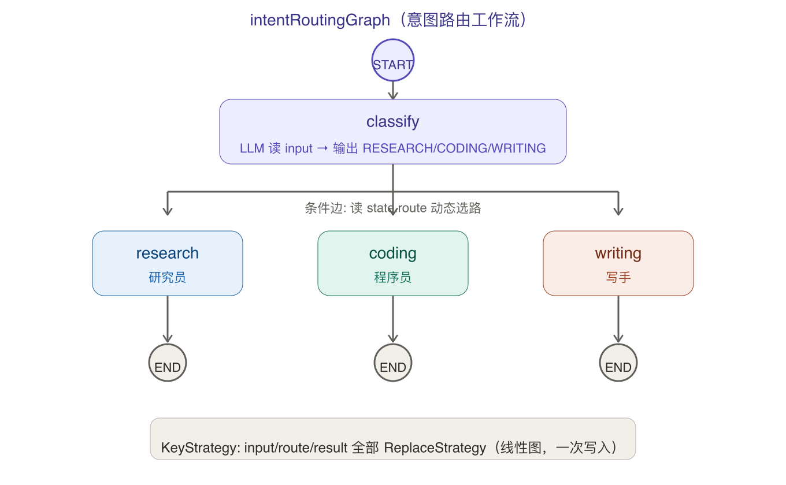
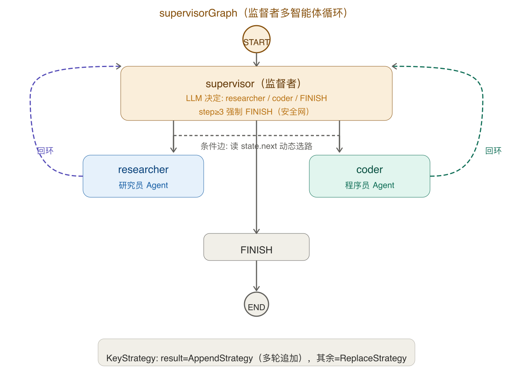

# 阶段 6 知识点总结 —— Agent 编排（graph-core + agent-framework）让多个 Agent 协作

> 阶段 6 目标：从"一个能调工具的 Agent"升级到"多个 Agent 协作 + 图编排"。这也是本系列第一次直面 **graph-core（Java 版 LangGraph）**——所有高层模式（ReactAgent / SequentialAgent / LlmRoutingAgent）底层就是一张有向图 `StateGraph`。
> 你已本地调试 + 验证全部通过 ✅，本篇把知识点、架构决策、踩坑、验证清单一并固化。

---

## 0. 一句话心智模型

> **Agent 编排 = 把多个 Agent 串成一张图，图中共享一个 `OverAllState`（传令兵），节点干活写 state，边管怎么走（普通边无条件 / 条件边读 state 动态选路）。** 阶段 4 是"一个 Agent 自己能调工具"，阶段 6 是"多个 Agent 分工协作"——前者是单兵作战，后者是排兵布阵。
>
> 再补一句定位：SAA 1.1.2.2 给了两层编排能力。**低层 `graph-core`**（手写 StateGraph）是积木；**高层 `agent-framework`**（ReactAgent / SequentialAgent / LlmRoutingAgent）是预制件。预制件封装了积木组合，但你可以直接拿积木造出任何预制件没有的形状（比如 Supervisor——本版本正好没有封装类，直接用 graph-core 手写）。

阶段 6 能力拼图（每个 = 一块可独立讲解的能力）：

| 能力 | 一句话 |
|---|---|
| graph-core 手写图 | `StateGraph` + `Node`（AsyncNodeAction）+ `Edge` + `ConditionalEdge` + `OverAllState` + `KeyStrategy` |
| ReactAgent（单 Agent 工具循环） | 复用阶段 4 的 5 个 `@Tool`，Agent 自主决定调哪些、调几次，`ToolCallRecorder` 可视化 |
| SequentialAgent（顺序串联） | 子 Agent 按顺序执行，前一个输出喂给后一个（写作 → 评审） |
| LlmRoutingAgent（路由分发） | LLM 判断问题类型，单次分发给最合适的子 Agent（研究 / 编程 / 写作，不循环） |
| 手写意图路由图 | graph-core 手写最小图：classify 节点（LLM 分类）→ 条件边 → 对应 worker → END |
| 手写 Supervisor 多智能体 | graph-core 手写监督者循环图：supervisor ⇄ worker 循环，step 计数防死循环，AppendStrategy 多轮追加 |

> 📐 图中「意图路由图」和「Supervisor 循环图」的结构示意已嵌入 `agent6.html` 对应 tab 中——点击 tab 里的「查看图结构」按钮即可展开查看。

---

## 1. 主线：两层编排能力的关系

```
高层 agent-framework（预制件）
├── ReactAgent          ──→ 底层就是 graph-core 的一张 Tool-Agent 循环图
├── SequentialAgent     ──→ 底层就是 graph-core 的链式图（A → B → C → END）
└── LlmRoutingAgent     ──→ 底层就是 graph-core 的分类+条件分发图

低层 graph-core（积木）
├── StateGraph          图的容器（addNode / addEdge / addConditionalEdges / compile）
├── OverAllState        贯穿全图的共享状态（Map<String,Object>，KeyStrategy 控制合并）
├── Node / NodeAction   节点 = 干活 + 写 state（return Map.of("key", value)）
├── Edge                普通边 = 无条件走
├── ConditionalEdge     条件边 = 读 state 动态选下一节点
└── KeyStrategy         多节点写同一 key 时怎么合并（ReplaceStrategy 覆盖 / AppendStrategy 追加）
```

**关键理解**：预制件只是帮你省了手写图的代码，但"所有高层模式底层就是一张图"。所以 SAA 1.1.2.2 没给 `SupervisorAgent` 封装类也不影响——你用 graph-core 手写出 `supervisorGraph`，效果一样，还更透明。

---

## 2. 核心原语（Spring AI Alibaba 1.1.2.2 实测 API）

### 2.1 建图四件套

```java
// 1) KeyStrategyFactory —— 声明 state 里每个 key 的合并策略
KeyStrategyFactory ksf = () -> Map.<String, KeyStrategy>of(
    "input",  new ReplaceStrategy(),   // 覆盖（每次新值替换旧值）
    "route",  new ReplaceStrategy(),
    "result", new AppendStrategy()     // 追加（多轮协作时每条输出拼到一起）
);

// 2) StateGraph —— 图的容器
StateGraph graph = new StateGraph("图名", ksf);

// 3) 加节点 —— node_async(NodeAction) 是 AsyncNodeAction 的静态工厂方法
graph.addNode("classify", node_async((OverAllState state) -> {
    String input = state.value("input", "");
    // ... 调 LLM ...
    return Map.of("route", "RESEARCH");  // 只返回要改的 key
}));

// 4) 加边
graph.addEdge(START, "classify");                         // 普通边：START → classify
graph.addConditionalEdges("classify",                      // 条件边：classify → 根据 route 选
    (OverAllState state) -> state.value("route", ""),
    Map.of("RESEARCH"→"research", "CODING"→"coding")
);
graph.addEdge("research", END);                           // 普通边：research → END

// 5) 编译——⚠️ compile() 抛 checked GraphStateException
CompiledGraph compiled = graph.compile();

// 6) 执行——传入初始 state，返回 Optional<OverAllState>
Optional<OverAllState> result = compiled.invoke(Map.of("input", "用户问题"));
```

### 2.2 Agent Framework 高层 API

```java
// ReactAgent —— 单 Agent 工具循环
ReactAgent agent = ReactAgent.builder()
    .name("工具型 Agent")
    .instruction("你是一个能调用工具的助手")
    .chatClient(ChatClient.builder(chatModel).build())
    .methodTools(dateTimeTool, calculatorTool, weatherTool, ...)  // 注册工具
    .build();
Optional<OverAllState> result = agent.invoke("帮我算 (23+19)*4");

// SequentialAgent —— 顺序串联
SequentialAgent seq = SequentialAgent.builder()
    .name("写作→评审")
    .subAgents(List.of(writerAgent, reviewerAgent))
    .build();

// LlmRoutingAgent —— LLM 路由分发
LlmRoutingAgent router = LlmRoutingAgent.builder()
    .name("路由分发")
    .instruction("根据问题类型分发给最合适的助手")
    .subAgents(List.of(researcherAgent, coderAgent, writerAgent))
    .build();
```

### 2.3 Agent.invoke() vs CompiledGraph.invoke() 返回值

两者都返回 `Optional<OverAllState>`。取结果的标准方式：

```java
Optional<OverAllState> opt = agent.invoke(query);  // 或 compiledGraph.invoke(map)
String result = opt.map(s -> {
    // state.value("messages") 默认是 List<AssistantMessage>
    List<AssistantMessage> msgs = s.value("messages");
    if (msgs != null && !msgs.isEmpty()) {
        return msgs.get(msgs.size() - 1).getText();  // ⚠️ 是 getText()，不是 getContent()
    }
    return s.value("result", "");  // 手写图的 fallback
}).orElse("");
```

> ⚠️ **Spring AI 1.1.2 的 `Content` 接口方法是 `getText()`**（不是 `getContent()`！）。`AssistantMessage` 继承 `Content`，所以取文本都是 `.getText()`。这是编译期就暴露的坑——写错直接红字，但很多旧教程/JDK 8 代码写的是 `getContent()`。

---

## 3. 五种编排形态逐一讲清

### 3.1 ReactAgent（单 Agent 工具循环）— `POST /api/agent6/react`

- 复用阶段 4 的 5 个 `@Tool`（DateTimeTool / CalculatorTool / WeatherTool / RagQueryTool / CreateTaskTool），通过 `methodTools(bean...)` 注册。
- Agent 在"思考→调工具→观察结果→再思考→..."的循环中自主推进，直到生成最终答案。
- 前端可视化：`ToolCallRecorder`（ThreadLocal）在每个 `@Tool` 方法执行时主动 `record(name, params)`，Controller 通过 `begin()/collect()/clear()` 收集，返回 `{result, toolCalls}`——100% 可靠，不依赖 `ChatResponse` 中可能缺失的 toolCalls。
- 返回格式：`{ "mode": "react", "result": "...", "toolCalls": [{"name":"CalculatorTool","params":{...}}] }`

### 3.2 SequentialAgent（顺序串联）— `POST /api/agent6/sequential`

- `writerAgent`（写作）→ `reviewerAgent`（评审），前者输出自动喂给后者。
- 每个都是纯 LLM 角色 ReactAgent（无工具），通过 `instruction(...)` 赋予角色。
- 返回格式：`{ "mode": "sequential", "result": "...", "trace": ["[写手] ...", "[评审] ..."] }`

### 3.3 LlmRoutingAgent（路由分发）— `POST /api/agent6/routing`

- LLM 读 query，判断 RESEARCH / CODING / WRITING，分发一次（不循环）。
- 子 Agent 是 researcherAgent / coderAgent / writerAgent（纯 LLM 角色）。
- 返回格式：`{ "mode": "routing", "result": "...", "trace": ["路由到：coder", "..."] }`

### 3.4 手写意图路由图 — `POST /api/agent6/workflow`

- 用 graph-core 手写的 `intentRoutingGraph`（`Agent6Config.java` 第 179–230 行）。
- 结构：`START → classify（LLM 分类）→ 条件边（读 state.route）→ research/coding/writing → END`。
- 三个 key 都用 `ReplaceStrategy`（线性图，一次写入）。
- Controller 从 `state.value("route")` 拿分类结果、`state.value("result")` 拿 worker 输出。
- 返回格式：`{ "mode": "workflow", "route": "RESEARCH", "result": "..." }`

### 3.5 手写 Supervisor 多智能体 — `POST /api/agent6/supervisor`

- 用 graph-core 手写的 `supervisorGraph`（`Agent6Config.java` 第 242–290 行）。
- 结构：`START → supervisor（LLM 决定 researcher/coder/FINISH）→ 条件边 → worker → 回环到 supervisor → ... → FINISH → END`。
- 三个关键设计：
  1. **回环边**：`addEdge("researcher", "supervisor")` / `addEdge("coder", "supervisor")`，不是去 END
  2. **AppendStrategy**：`result` 用 AppendStrategy，每轮 worker 输出追加到一起
  3. **step 计数防死循环**：`int step = state.value("step", 0); if (step >= 3) return Map.of("next", "FINISH")`
- 返回格式：`{ "mode": "supervisor", "result": "[研究员] ... [程序员] ..." }`

---

## 4. 踩坑大全（阶段 6 真实踩过的 4 个坑，全部编译期暴露）

| # | 坑 | 现象 | 解决 |
|---|---|---|---|
| 1 | **`AssistantMessage.getContent()` 不存在** | 编译报错 3 处 | Spring AI 1.1.2 的 `Content` 接口方法是 `getText()`，全部改为 `.getText()` |
| 2 | **`GraphStateException` 是 checked 异常** | `addNode/addEdge/compile` 全部编译报错 ~18 处 | 给包含这些调用的 `@Bean` 方法签名加 `throws GraphStateException`，并导入异常类 |
| 3 | **SAA 1.1.2.2 不含 `SupervisorAgent` 封装类** | grep 完全无命中 | 用 `graph-core` 手写 `supervisorGraph`（回环 + step 计数 + AppendStrategy），效果完全相同 |
| 4 | **`KeyStrategyFactory` lambda 泛型推断失败** | `Map.of("input", new ReplaceStrategy(), ...)` 推断为 `Map<String, ReplaceStrategy>` 而非 `Map<String, KeyStrategy>` | 显式类型参数：`Map.<String, KeyStrategy>of(...)`，并导入 `KeyStrategy` |

> 坑 1 和 2 是编译期就暴露的，不会留到运行时——这是静态类型语言的优势。坑 3 是调研结论（需要事先确认版本能力边界，避免像阶段 5 那样走"前提不成立"的弯路）。坑 4 是 Java 泛型不变性的经典场景。

---

## 5. 图结构速查（两张核心图）

> 以下两张图也可在 `agent6.html` 对应 tab 中点击「📐 查看图结构」按钮展开查看。
> 点击图片可放大查看。

### 5.1 intentRoutingGraph（意图路由工作流）



线性图：`START → classify（LLM 分类）→ 条件边（读 state.route）→ research/coding/writing → END`。三个 key 全部用 `ReplaceStrategy`（覆盖），因为线性图只需要一次写入。

### 5.2 supervisorGraph（监督者多智能体循环）



循环图：`START → supervisor（LLM 决定下一步）→ 条件边（读 state.next）→ researcher/coder → 回环到 supervisor → ... → FINISH → END`。`result` 用 `AppendStrategy`（追加），因为多轮协作每轮 worker 的输出需要拼接；`step` 自增计数，≥3 强制 FINISH 防死循环。

---

## 6. 配置与依赖

### 6.1 pom.xml（阶段 6 新增）

```xml
<!-- graph-core 与 agent-framework，版本由 spring-ai-alibaba BOM 统一管理 -->
<dependency>
    <groupId>com.alibaba.cloud.ai</groupId>
    <artifactId>spring-ai-alibaba-agent-framework</artifactId>
</dependency>
<dependency>
    <groupId>com.alibaba.cloud.ai</groupId>
    <artifactId>spring-ai-alibaba-graph-core</artifactId>
</dependency>
```

### 6.2 编排模型配置

编排主力模型沿用 **DeepSeek V4**（阶段 4 已验证能跑 tool loop）。`Agent6Config` 中：

```java
@Bean
ChatClient orchestrationClient(@Qualifier("deepSeekChatModel") ChatModel model) {
    return ChatClient.builder(model).build();  // 不挂记忆 Advisor
}
```

> ⚠️ 如果 Supervisor 嵌套 tool-calling 在 DeepSeek 上不稳定，可以把 `orchestrationClient` 改用 `dashScopeChatModel`（qwen）。

---

## 7. 端到端数据流

### 7.1 ReactAgent

```
浏览器输入 → POST /api/agent6/react {query}
  → Agent6Controller
  → ToolCallRecorder.begin()
  → reactAgent.invoke(query)   // Agent 内部：思考→调工具→观察→再思考→...→最终答案
  → ToolCallRecorder.collect()  // 收集工具调用明细
  → ToolCallRecorder.clear()    // finally 块清 ThreadLocal
  → { mode:"react", result: "...", toolCalls: [...] }
  → 前端渲染：结果 + 工具调用轨迹
```

### 7.2 手写图（workflow / supervisor）

```
浏览器输入 → POST /api/agent6/workflow|supervisor {query}
  → Agent6Controller
  → compiledGraph.invoke(Map.of("input", query))
  → 图内部：节点按边串联执行，每节点读 state → 干活 → 写 state
  → 返回 Optional<OverAllState>
  → Controller 从 state 取 result / route 等
  → { mode:"workflow"|"supervisor", result:"...", route:"..." }
  → 前端渲染
```

---

## 8. 验证清单（你本机已完成 ✅）

- [x] `mvn compile` 通过（graph-core / agent-framework 依赖正确，无编译错误）
- [x] `/agent6.html` ReactAgent：输入 `(23+19)*4 并查时间`，工具调用可视化正常
- [x] `/agent6.html` SequentialAgent：写作 → 评审，输出合理
- [x] `/agent6.html` LlmRoutingAgent：正确识别 RESEARCH/CODING/WRITING
- [x] `/agent6.html` 意图路由图（workflow）：classify 正确分类，worker 正常产出
- [x] `/agent6.html` Supervisor：多轮协作正常，step≥3 安全网生效
- [x] `AI_DEEPSEEK_API_KEY` 已配置（编排主力模型可用）
- [x] 图结构图示可正常展开（agent6.html 中 workflow 和 supervisor tab 内）

---

## 9. 前后阶段衔接

- **复用阶段 4 的工具**：ReactAgent 直接复用阶段 4 的 5 个 `@Tool` Bean，`ToolCallRecorder` 也在阶段 4 落地，阶段 6 只加注入不重写。
- **与已有模型栈共存**：编排模型栈 = DeepSeek V4（编排主力）+ 5 个 `@Tool`（工具）+ Ollama bge-m3（RAG 工具中的 embedding）。与阶段 0–5 的 ChatModel 通过 `@Qualifier` + 独立 `ChatClient` 实例区分，互不干扰。
- **为阶段 7（MCP 集成）铺路**：Agent 编排的"工具注册"模式（`methodTools(...)`）与 MCP 的"工具发现"天然衔接——后续可以把 MCP 远程工具注入到 Agent 的工具列表，让 Agent 编排能力延伸到外部系统。
- **为阶段 8（工程化）铺路**：多 Agent 协作涉及多个 LLM 调用，可观测（Langfuse trace 串联）、Guardrails（每次调用前后的安全校验）的价值在编排场景下被放大。

---

## 附：一句话带走本阶段

> **Agent 编排 = StateGraph + OverAllState + KeyStrategy。** 高层 ReactAgent / SequentialAgent / LlmRoutingAgent 是预制件，手写图是积木。所有高层模式底层就是一张图——哪怕 SAA 没给 SupervisorAgent 封装类，用 graph-core 手写一个回环 + step 计数 + AppendStrategy 就能实现。调 API 牢记：`getText()` 不叫 `getContent()`、`GraphStateException` 是 checked、`KeyStrategyFactory` 泛型要显式。
